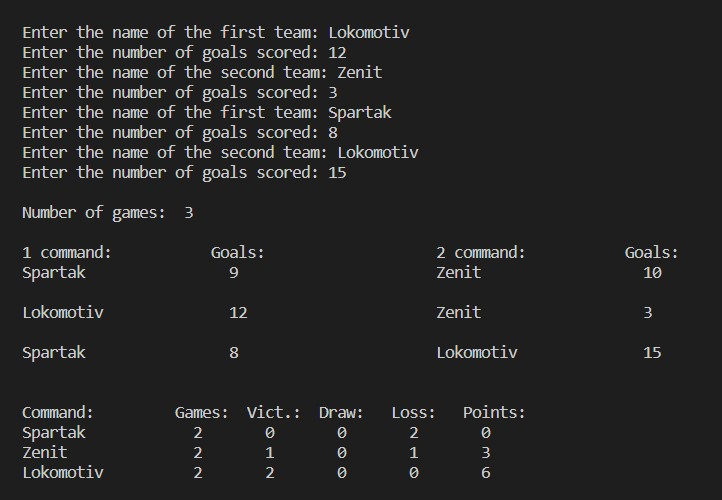

# Задача 1. Создайте программу для игры в "Крестики-нолики".
Выполнен вариант игры человека с человеком.
## Пример работы программы Задача №1:

# Задача 2. Напишите программу вычисления арифметического выражения заданного строкой.
Используйте операции +,-,/,*. приоритет операций стандартный.

*Пример:* 
2+2 => 4; 
1+2*3 => 7; 
1-2*3 => -5;

Добавьте возможность использования скобок, меняющих приоритет операций.
*Пример:* 
1+2*3 => 7; 
(1+2)*3 => 9;

Выполнен вариант калькулятора, в котором задается строкой пример с целыми числами и в терминал выводится результат. Максимальная длина рассчёта - три цифры и два знака. Например: 125/5-15.

## Пример работы программы Задача №2:

# Задача 3. FOOTBALL необязательная. 
# Напишите программу, которая принимает на стандартный вход список игр футбольных команд с результатом матча и выводит на стандартный вывод сводную таблицу результатов всех матчей.

За победу команде начисляется 3 очка, за поражение — 0, за ничью — 1.

Формат ввода следующий:
* В первой строке указано целое число nn — количество завершенных игр.
* После этого идет nn строк, в которых записаны результаты игры в следующем формате:
* Перваякоманда;Забитопервойкомандой;Втораякоманда;Забитовторойкомандой

Вывод программы необходимо оформить следующим образом:

Команда:Всегоигр Побед Ничьих Поражений Всегоочков

Конкретный пример ввода-вывода приведён ниже.

Порядок вывода команд произвольный.

Sample Input:

3

Спартак;9;Зенит;10

Локомотив;12;Зенит;3

Спартак;8;Локомотив;15

Sample Output:

Спартак:2 0 0 2 0

Зенит:2 1 0 1 3

Локомотив:2 2 0 0 6

## Пример работы программы Задача №3:

